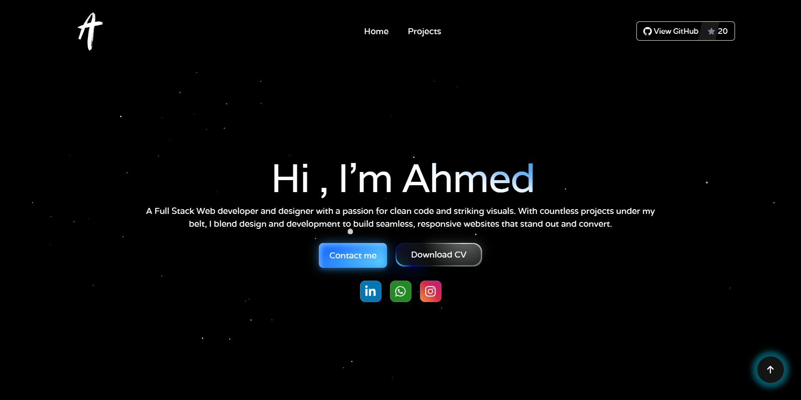

# 🌐 Ahmed Gito — Personal Portfolio Website

This is the source code for **Ahmed Gito's personal portfolio website**, built to showcase projects, skills, and contact information in a modern, responsive design.

> 🔗 **Live Site**: [ahmedgito-github-io.vercel.app](https://ahmedgito-github-io.vercel.app)

---

## 🖼️ Preview



---

## ✨ Features

- 🧑‍💻 Clean and professional portfolio design
- 📱 Fully responsive layout (mobile, tablet, desktop)
- 🛠️ Projects showcase with descriptions and links
- 📇 About section with skills and experience
- 📬 Contact form with interactive UI
- 🚀 Deployed on Vercel for fast global delivery

---

## 🧰 Tech Stack

- **Framework**: [React](https://reactjs.org/)
- **Styling**: [Tailwind CSS](https://tailwindcss.com/)
- **Animations**: Framer Motion *(based on UI transitions)*
- **Deployment**: [Vercel](https://vercel.com/)

---

## 📦 Installation

Clone the repository and install dependencies:

```bash
git clone https://github.com/your-username/your-repo-name.git
cd your-repo-name
npm install
